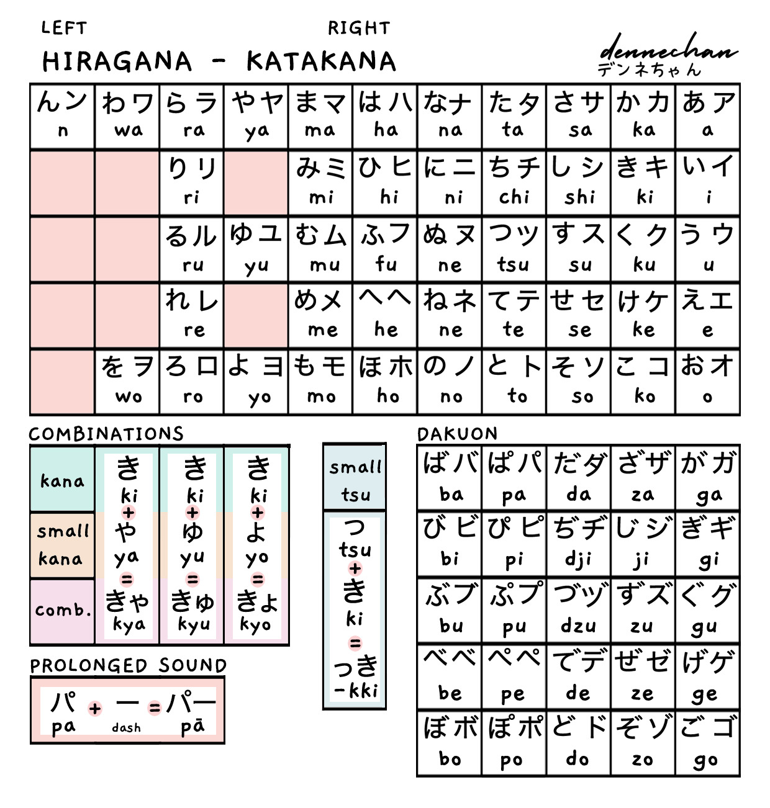

# git-learning
Md. Nur Alam Akash <br/>
This is my github profile 
---
### Heading Style

## Md. Nur Alam Akash 
### Md. Nur Alam Akash
#### Md. Nur Alam Akash
##### Md. Nur Alam Akash
###### Md. Nur Alam Akash

### Paragraph 
<p>This is Akash. I've just done my job</p>

### Text Style
<i>This is Akash. I've just done my job</i>
<b>hello this is me, bold</b>  
<u>hello this is me, underlined</u>  
__This is bold too__  
___This is bold and italic too too___  
_this is only italic_  
<del>This is wrong</del>  
~~This is wrong too~~

### Single Line code
`This is inline`  
`<h1>Hello World</h1>`


### Multiple Line code
```html  
<html>
    <head>
    <title>Page Title</title>
        This is a code block
    </head>
</html>
```

```CSS
    head{
        background-color: #f2f2f2;
    }
```

```javascript
console.log("Hello World");
```


### Ordered List
<ol>
<li>Item 1</li>
<li>Item 2</li>
</ol>

1. Akash
    1. Nur Alam
2. Siam


### Unordered List
- Akash
    - Nur Alam
- Siam

### Task List
- [x] Task 1
- [ ] Task 2

### Automatic Link
https://www.google.com  
`https://www.google.com`

### Disable Link
`https://www.google.com`

### Markdown Link
[Google](https://www.google.com)  
`[Google](https://www.google.com)`

<br/>

[Google][Weblink]  
[Google](Weblink)  
`[Google](Weblink)`  
`[Google][Weblink]`  
`[Weblink]: https://www.google.com`

<!-- All link is here -->
[Weblink]: https://www.google.com

### Image
<!--  -->
``  

<br/><br/>

  

``````

### Table
| Name | Age | Gender |
| --- | --- | --- |
| Akash | 20 | Male |
| Siam | 22 | Male |
| Akash | 20 | Male |
| Siam | 22 | Male |


